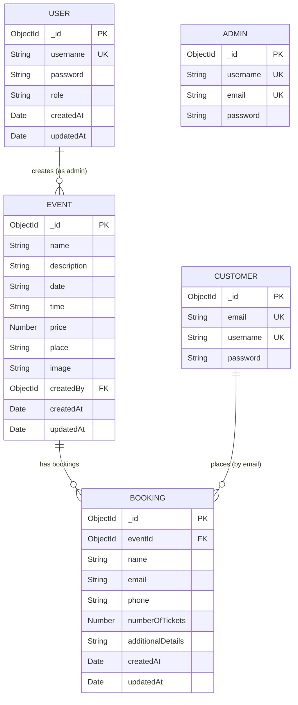
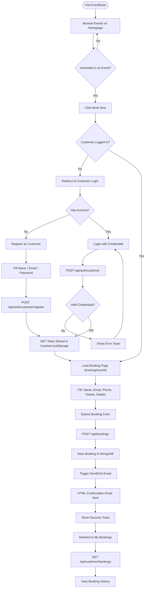
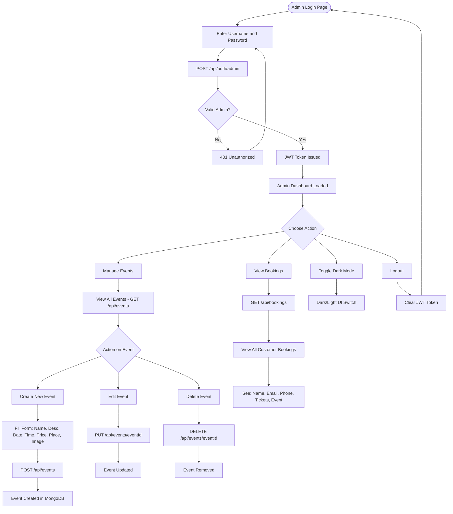
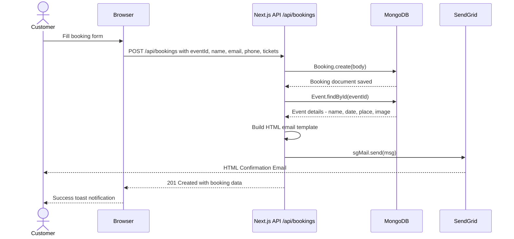

<div align="center">

# 🎪 EventEase

### *A Full-Stack Event Registration & Management Platform*

<br/>


<br/>


</div>

---

## 📋 Table of Contents

- [Overview](#-overview)
- [Tech Stack](#-tech-stack)
- [Architecture Overview](#-architecture-overview)
- [ER Diagram](#-er-diagram)
- [User Flow Diagrams](#-user-flow-diagrams)
  - [Customer Flow](#customer-flow)
  - [Admin Flow](#admin-flow)
  - [Booking & Email Flow](#booking--email-flow)
- [API Reference](#-api-reference)
- [Project Structure](#-project-structure)
- [Environment Variables](#-environment-variables)
- [Getting Started](#-getting-started)
- [Deployment](#-deployment)
- [Contributing](#-contributing)

---

## 🌟 Overview

**EventEase** is a production-ready, full-stack event registration and management platform built with the **Next.js App Router**. It provides a dual-portal system — one for **admins** to manage events and one for **customers** to discover, browse, and register for events — all backed by real-time MongoDB persistence and automated email confirmations.

### ✨ Key Features

| Feature | Description |
|---|---|
| 🔐 **Dual Auth System** | Separate JWT-based login for Admins and Customers |
| 📅 **Event Management** | Full CRUD operations for events with rich details |
| 🎟️ **Booking System** | Customers can book tickets with multi-seat support |
| 📧 **Email Confirmations** | Automated HTML booking confirmation emails via SendGrid |
| 🔍 **Smart Search & Filter** | Filter events by price, location, date range |
| 📊 **Admin Dashboard** | Centralized hub to manage events, view bookings |
| 🌙 **Dark Mode** | Admin dashboard dark mode toggle |
| 📈 **Analytics** | Vercel Analytics integration for traffic insights |

---

## 🛠 Tech Stack

### Full Stack Wiring Diagram

```
┌─────────────────────────────────────────────────────────────────────┐
│                         CLIENT (Browser)                            │
│                                                                     │
│  ┌───────────────────────┐      ┌────────────────────────────┐      │
│  │   React 19 (UI)       │      │   TailwindCSS v4 (Styles)  │      │
│  │   - Hooks & State     │      │   - Utility classes         │      │
│  │   - lucide-react icons│      │   - Responsive grid         │      │
│  │   - react-toastify    │      │   - Dark mode variants      │      │
│  └───────────────────────┘      └────────────────────────────┘      │
│                                                                     │
│  ┌──────────────────────────────────────────────────────────────┐   │
│  │               Next.js 15 App Router                          │   │
│  │   /                  → Public Event Listing (SSR)            │   │
│  │   /booking/[eventId] → Customer Booking Page                 │   │
│  │   /customer/register → Customer Registration                 │   │
│  │   /customer/login    → Customer Login                        │   │
│  │   /customer/my-bookings → Booking History                    │   │
│  │   /admin/login       → Admin Login                           │   │
│  │   /admin/dashboard   → Admin Dashboard                       │   │
│  │   /admin/bookings    → Booking Management                    │   │
│  └──────────────────────────────────────────────────────────────┘   │
└───────────────────────────────┬─────────────────────────────────────┘
                                │ HTTP / Fetch API
                                ▼
┌─────────────────────────────────────────────────────────────────────┐
│                    SERVER (Next.js API Routes)                      │
│                                                                     │
│  ┌───────────────────────────────────────────────────────────────┐  │
│  │  Route Handlers  (app/api/**/route.js)                        │  │
│  │                                                               │  │
│  │  POST /api/auth/admin          → Admin Login + JWT issue      │  │
│  │  POST /api/auth/customer       → Customer Login + JWT issue   │  │
│  │  GET  /api/events              → Fetch All Events             │  │
│  │  POST /api/events              → Create Event (Admin)         │  │
│  │  GET  /api/events/[eventId]    → Fetch Single Event           │  │
│  │  POST /api/bookings            → Create Booking + send Email  │  │
│  │  GET  /api/bookings            → Fetch All Bookings (Admin)   │  │
│  │  GET  /api/customer/bookings   → Fetch My Bookings            │  │
│  │  GET  /api/admin/details       → Fetch Admin Info             │  │
│  │  GET  /api/customer/details    → Fetch Customer Info          │  │
│  │  POST /api/send-email          → Manual Email Trigger         │  │
│  └───────────────────────────────────────────────────────────────┘  │
│                                                                     │
│  ┌──────────────────┐    ┌────────────────────────────────────────┐  │
│  │  authMiddleware  │    │         lib/tokenUtils.js              │  │
│  │  - Bearer token  │    │  - JWT sign / verify helpers           │  │
│  │  - Role checks   │◄───│  - Token decode utilities              │  │
│  │  - 401 / 403     │    └────────────────────────────────────────┘  │
│  └──────────────────┘                                               │
│                                                                     │
└─────────┬───────────────────────────────┬───────────────────────────┘
          │                               │
          ▼                               ▼
┌──────────────────────┐       ┌─────────────────────────┐
│   MongoDB Atlas      │       │   SendGrid Email API     │
│   (via Mongoose 8)   │       │                         │
│                      │       │  ✉ Booking Confirmation  │
│  Collections:        │       │  ✉ Event Notifications   │
│  - users             │       │                         │
│  - admins            │       │  From:                  │
│  - customers         │       │  eventhub.company12     │
│  - events            │       │  @gmail.com             │
│  - bookings          │       │                         │
└──────────────────────┘       └─────────────────────────┘
```

### Tech Stack Summary

| Layer | Technology | Purpose |
|---|---|---|
| **Framework** | Next.js 15 (App Router) | SSR, routing, API routes |
| **UI Library** | React 19 | Component-based UI |
| **Styling** | TailwindCSS v4 | Utility-first CSS |
| **Icons** | lucide-react, react-icons | UI iconography |
| **Database** | MongoDB + Mongoose 8 | Data persistence & schemas |
| **Auth** | JWT (jsonwebtoken) + bcryptjs | Secure token-based auth |
| **Email** | SendGrid (@sendgrid/mail) | Transactional emails |
| **Notifications** | react-toastify | In-app toast alerts |
| **Analytics** | @vercel/analytics | Page view tracking |
| **Fonts** | Google Fonts (Geist) | Typography |
| **Deployment** | Vercel | CI/CD + Hosting |

---

## 🏗 Project Structure

```
event-registration/
│
├── app/                          ← Next.js App Router Root
│   ├── layout.js                 ← Global layout + fonts + analytics
│   ├── page.js                   ← Public homepage (event listing)
│   │
│   ├── api/                      ← Server-side Route Handlers
│   │   ├── auth/
│   │   │   ├── admin/route.js    ← Admin login endpoint
│   │   │   └── customer/route.js ← Customer login endpoint
│   │   ├── events/
│   │   │   ├── route.js          ← GET all / POST create event
│   │   │   └── [eventId]/route.js← GET / PUT / DELETE single event
│   │   ├── bookings/
│   │   │   └── route.js          ← POST create booking + email trigger
│   │   ├── admin/
│   │   │   └── details/route.js  ← GET logged-in admin details
│   │   ├── customer/
│   │   │   ├── details/route.js  ← GET logged-in customer details
│   │   │   └── bookings/route.js ← GET customer booking history
│   │   └── send-email/route.js   ← Manual email dispatch
│   │
│   ├── admin/                    ← Admin Portal Pages
│   │   ├── layout.js             ← Admin layout wrapper
│   │   ├── login/page.js         ← Admin login form
│   │   ├── dashboard/page.js     ← Admin dashboard + event CRUD
│   │   └── bookings/page.js      ← Booking management view
│   │
│   ├── customer/                 ← Customer Portal Pages
│   │   ├── layout.js             ← Customer layout wrapper
│   │   ├── login/page.js         ← Customer login
│   │   ├── register/page.js      ← Customer registration
│   │   └── my-bookings/page.js   ← Customer booking history
│   │
│   ├── booking/
│   │   └── [eventId]/page.js     ← Event booking page (per event)
│   │
│   └── components/               ← Shared UI Components
│       ├── Navbar.js             ← Public-facing navbar
│       ├── AdminNavbar.js        ← Admin top navigation
│       ├── AdminSidebar.js       ← Admin collapsible sidebar
│       ├── CreativeFooter.js     ← Styled footer
│       └── FilterSidebar.js      ← Event filter panel
│
├── models/                       ← Mongoose Data Models
│   ├── User.js                   ← Shared user schema (role-based)
│   ├── Admin.js                  ← Admin-specific schema
│   ├── Customer.js               ← Customer-specific schema
│   ├── Event.js                  ← Event schema
│   └── Booking.js                ← Booking schema
│
├── lib/                          ← Server-side Utilities
│   ├── mongodb.js                ← Mongoose connection (cached)
│   ├── authMiddleware.js         ← JWT verify + role-based guard
│   ├── tokenUtils.js             ← JWT sign/verify helpers
│   └── sendgrid.js               ← SendGrid email helper
│
└── public/                       ← Static Assets
```

---

## 🗄 ER Diagram

The following Entity-Relationship diagram shows the data model and how collections are linked in MongoDB:



> **Note:** `User` is the shared authentication model with role-based access (`admin` | `customer`). `Admin` and `Customer` are supplementary profile models. Bookings are linked to Events via `eventId` and implicitly to customers via `email`.

---

## 🔄 User Flow Diagrams

### Customer Flow



### Admin Flow



### Booking & Email Flow



---

## 📡 API Reference

### Authentication

| Method | Endpoint | Description | Auth Required |
|---|---|---|---|
| `POST` | `/api/auth/admin` | Admin login → JWT token | ❌ |
| `POST` | `/api/auth/customer` | Customer login → JWT token | ❌ |
| `POST` | `/api/customer/register` | Register new customer | ❌ |

### Events

| Method | Endpoint | Description | Auth Required |
|---|---|---|---|
| `GET` | `/api/events` | Fetch all events | ❌ |
| `POST` | `/api/events` | Create a new event | ✅ Admin |
| `GET` | `/api/events/[eventId]` | Fetch single event | ❌ |
| `PUT` | `/api/events/[eventId]` | Update an event | ✅ Admin |
| `DELETE` | `/api/events/[eventId]` | Delete an event | ✅ Admin |

### Bookings

| Method | Endpoint | Description | Auth Required |
|---|---|---|---|
| `POST` | `/api/bookings` | Create a booking + send email | ❌ |
| `GET` | `/api/bookings` | Fetch all bookings | ✅ Admin |
| `GET` | `/api/customer/bookings` | Fetch current customer's bookings | ✅ Customer |

### Users

| Method | Endpoint | Description | Auth Required |
|---|---|---|---|
| `GET` | `/api/admin/details` | Fetch logged-in admin's profile | ✅ Admin |
| `GET` | `/api/customer/details` | Fetch logged-in customer's profile | ✅ Customer |

### Utilities

| Method | Endpoint | Description | Auth Required |
|---|---|---|---|
| `POST` | `/api/send-email` | Manually trigger an email | ✅ Admin |

---

## 🔐 Authentication Wiring

```
┌──────────────────────────────────────────────────────────────┐
│                    Authentication Flow                       │
│                                                              │
│  Login Form ──► POST /api/auth/* ──► bcryptjs.compare()      │
│                                           │                  │
│                                    Valid? ▼                  │
│                              jwt.sign({ id, role })          │
│                                    │                         │
│                              Token returned                  │
│                                    │                         │
│              ┌─────────────────────┴────────────────────┐   │
│              │         Client stores token               │   │
│              │   (localStorage / httpOnly cookie)        │   │
│              └─────────────────────┬────────────────────┘   │
│                                    │                         │
│              Protected Request ──► Authorization: Bearer token
│                                    │                         │
│                            authMiddleware.js                 │
│                                    │                         │
│                         jwt.verify(token, SECRET)            │
│                                    │                         │
│              ┌─────────────────────┴──────────────────┐     │
│              │  Role check: allowedRoles.includes(role)│     │
│              └──────┬─────────────────────────┬───────┘     │
│                     │                         │             │
│               Pass                       Fail               │
│               req.user = decoded         403 Forbidden       │
│               handler(req, res)          401 Unauthorized    │
└──────────────────────────────────────────────────────────────┘
```

---

## 🌐 Environment Variables

Create a `.env.local` file in the project root with the following variables:

```env
# ─── Database ─────────────────────────────
MONGO_URI=mongodb+srv://<username>:<password>@cluster.mongodb.net/event-registration

# ─── Authentication ───────────────────────
JWT_SECRET_KEY=your_super_secret_jwt_key_here

# ─── Email (SendGrid) ─────────────────────
SENDGRID_API_KEY=SG.xxxxxxxxxxxxxxxxxxxxxxxx

# ─── App Base URL ─────────────────────────
NEXT_PUBLIC_BASE_URL=http://localhost:3000
```

> ⚠️ Never commit `.env.local` to version control. It is already included in `.gitignore`.

---

## 🚀 Getting Started

### Prerequisites

- **Node.js** `>= 18.0`
- **npm** `>= 9.0`
- A **MongoDB Atlas** cluster (free tier works)
- A **SendGrid** account with a verified sender

### Installation

```bash
# 1. Clone the repository
git clone https://github.com/Aryansinha123/Event_Manager.git
cd event-registration

# 2. Install dependencies
npm install

# 3. Set up environment variables
cp .env.example .env.local
# Then edit .env.local with your credentials

# 4. Run the development server
npm run dev
```

Open [http://localhost:3000](http://localhost:3000) in your browser.

### Build for Production

```bash
npm run build
npm run start
```

---

## 📦 Deployment

### Vercel (Recommended)

1. Push your code to GitHub
2. Import the project on [vercel.com](https://vercel.com)
3. Add all environment variables in the Vercel dashboard under **Settings → Environment Variables**
4. Deploy — Vercel auto-detects Next.js and configures everything

```bash
# Or deploy via Vercel CLI
npx vercel --prod
```

> ✅ Vercel Analytics (`@vercel/analytics`) is already integrated and will activate automatically on deployment.

---

## 🤝 Contributing

Contributions are welcome! Please follow these steps:

1. Fork the repository
2. Create a feature branch: `git checkout -b feature/your-feature-name`
3. Commit your changes: `git commit -m 'feat: add some feature'`
4. Push to the branch: `git push origin feature/your-feature-name`
5. Open a Pull Request

### Pending Features (Good First Issues)

- [ ] Password encryption for Admin passwords (bcrypt)
- [ ] JWT token refresh / expiry handling
- [ ] File upload support for event images
- [ ] Pagination for event listing
- [ ] Dark mode for customer portal
- [ ] Inline form validation with error messages
- [ ] Admin dashboard statistics (total events, bookings)
- [ ] End-to-end testing setup

---

## 📄 License

This project is licensed under the **MIT License**.

---

<div align="center">

Made with ❤️ using **Next.js**, **MongoDB**, and **SendGrid**

⭐ Star this repo if you found it useful!

</div>
